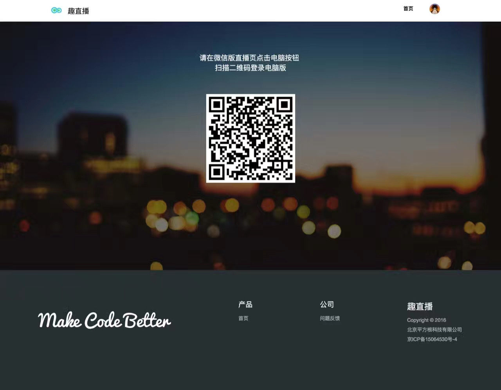

### Fun Live: Knowledge Live Broadcast Platform

Fun Live is a cutting-edge knowledge live broadcast platform designed to facilitate engaging educational experiences for users across various disciplines, including programming and design. With Fun Live, users can seamlessly participate in live lectures, contribute through fees or rewards, and enjoy playback options for added convenience.

* [live-server](https://github.com/lzwjava/live-server)
* [live-web](https://github.com/lzwjava/live-web)
* [live-mobile-web](https://github.com/lzwjava/live-mobile-web)

<div align="center">


</div>




#### Features

- **Live Lectures**: Access diverse knowledge lectures in real-time, covering a wide range of topics.
- **Monetization Options**: Users can pay fees to attend live sessions or reward lecturers for their valuable insights.
- **OBS Integration**: Lecturers can effortlessly push live streams using the OBS tool, ensuring smooth broadcasting.
- **Playback Functionality**: Enjoy the flexibility to participate in lectures in real-time or access playback later.
- **Seamless WeChat Integration**: Integrate seamlessly with the WeChat platform, including notifications functionality for enhanced user engagement.

#### Usage
1. Clone the repository.
2. Open the project in your preferred development environment.
3. Customize and configure settings as needed.
4. Deploy the application to your server.
5. Start broadcasting engaging knowledge lectures and delight your users!

#### Statistics
- **Lectures Hosted**: Approximately 80 lectures hosted.
- **User Base**: Over 30,000 users engaged.
- **Page Views**: Millions of page views generated.

#### File Structure

```
├── cache
│   └── index.html
├── config
│   ├── alipay.php
│   ├── autoload.php
│   ├── config.php
│   ├── constants.php
│   ├── database.php
│   ├── doctypes.php
│   ├── foreign_chars.php
│   ├── hooks.php
│   ├── index.html
│   ├── memcached.php
│   ├── migration.php
│   ├── mimes.php
│   ├── profiler.php
│   ├── rest.php
│   ├── routes.php
│   ├── smileys.php
│   └── user_agents.php
├── controllers
│   ├── Accounts.php
│   ├── Applications.php
│   ├── Attendances.php
│   ├── Charges.php
│   ├── Coupons.php
│   ├── Files.php
│   ├── Jobs.php
│   ├── LiveHooks.php
│   ├── LiveViews.php
│   ├── Lives.php
│   ├── Packets.php
│   ├── Qrcodes.php
│   ├── RecordedVideos.php
│   ├── Rest_server.php
│   ├── Rewards.php
│   ├── Shares.php
│   ├── Staffs.php
│   ├── Stats.php
│   ├── Subscribes.php
│   ├── Topics.php
│   ├── Users.php
│   ├── Videos.php
│   ├── Wechat.php
│   ├── WechatGroups.php
│   ├── Withdraws.php
│   └── index.html
├── core
│   ├── BaseController.php
│   └── index.html
├── data
│   ├── bjfudata.txt
│   └── iDev.json
├── helpers
│   ├── base_helper.php
│   └── index.html
├── hooks
│   └── index.html
├── id
├── index.html
├── language
│   ├── english
│   │   ├── index.html
│   │   └── rest_controller_lang.php
│   └── index.html
├── libraries
│   ├── Format.php
│   ├── JSSDK.php
│   ├── LeanCloud.php
│   ├── Pay.php
│   ├── QiniuLive.php
│   ├── REST_Controller.php
│   ├── Sms.php
│   ├── WeChatAppClient.php
│   ├── WeChatClient.php
│   ├── WeChatPlatform.php
│   ├── alipay
│   │   ├── Alipay.php
│   │   └── lib
│   │       ├── alipay_core.function.php
│   │       ├── alipay_notify.class.php
│   │       ├── alipay_rsa.function.php
│   ├── index.html
│   ├── wx
│   │   ├── WxPay.JsApiPay.php
│   │   ├── WxPay.php
│   │   ├── WxPayCallback.php
│   │   ├── cert
│   │   │   ├── ...
│   │   │   └── ...
│   │   └── lib
│   │       ├── WxPay.Api.php
│   │       ├── WxPay.Config.php
│   │       ├── WxPay.Data.php
│   │       ├── WxPay.Exception.php
│   │       └── WxPay.Notify.php
│   └── wxencrypt
│       ├── WxBizDataCrypt.php
│       ├── demo.php
│       ├── errorCode.php
│       └── pkcs7Encoder.php
├── logs
│   └── index.html
├── models
│   ├── AccountDao.php
│   ├── ApplicationDao.php
│   ├── AttendanceDao.php
│   ├── BaseDao.php
│   ├── ChargeDao.php
│   ├── CouponDao.php
│   ├── JobDao.php
│   ├── JobHelperDao.php
│   ├── LiveDao.php
│   ├── LiveViewDao.php
│   ├── PacketDao.php
│   ├── ParamDao.php
│   ├── PayNotifyDao.php
│   ├── QiniuDao.php
│   ├── RecordedVideoDao.php
│   ├── RewardDao.php
│   ├── ShareDao.php
│   ├── SnsUserDao.php
│   ├── StaffDao.php
│   ├── StatusDao.php
│   ├── SubscribeDao.php
│   ├── TopicDao.php
│   ├── TransactionDao.php
│   ├── UserDao.php
│   ├── UserPacketDao.php
│   ├── VideoDao.php
│   ├── WechatEventsDao.php
│   ├── WechatGroupDao.php
│   ├── WithdrawDao.php
│   ├── WxAppDao.php
│   ├── WxDao.php
│   ├── WxSessionDao.php
│   └── index.html
├── third_party
│   └── index.html
└── views
    ├── errors
    │   ├── cli
    │   │   ├── error_404.php
    │   │   ├── error_db.php
    │   │   ├── error_exception.php
    │   │   ├── error_general.php
    │   │   ├── error_php.php
    │   │   └── index.html
    │   ├── html
    │   │   ├── error_404.php
    │   │   ├── error_db.php
    │   │   ├── error_exception.php
    │   │   ├── error_general.php
    │   │   ├── error_php.php
    │   │   └── index.html
    │   └── index.html
    └── index.html


# Contributors

| Commits | Author |
| ------ | ---- |
|   555 | lzwjava|
|    28|  Liu-Sheng Xin|
|    24|  PegasusWang|
|    24 | wujunze|
|    18 | liushengxin|
|     5|  Anrika|
|     4  |Amast|
